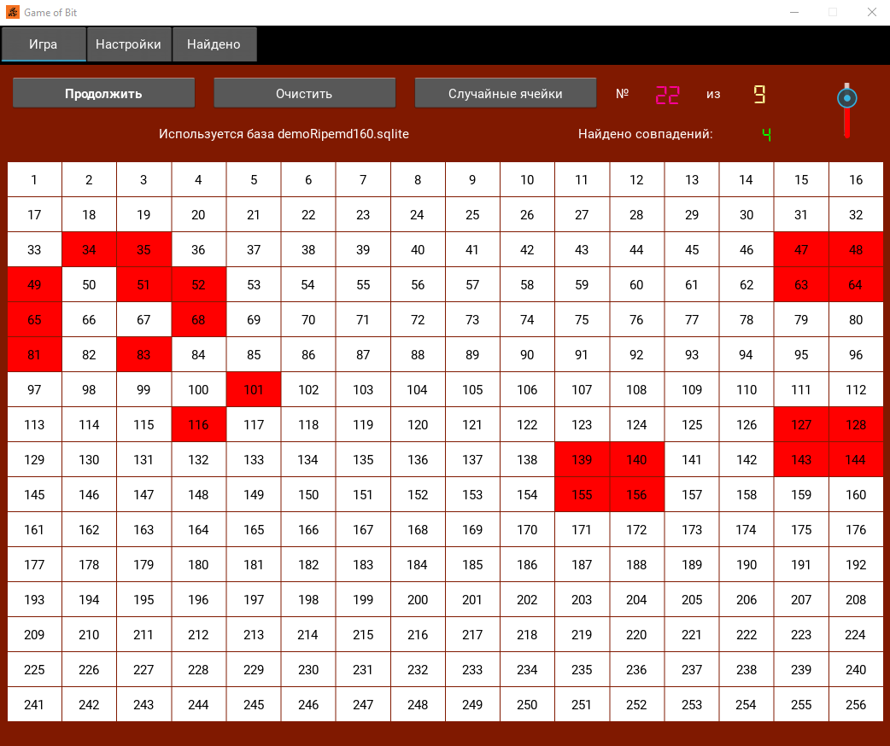

# Game of Bit : like Game of Life for Bitcoin
"Игра Жизнь" на поле 16х16 клеток.
На каждом этапе эволюции из живых клеток формируется приватный ключ Биткоина, из него сжатый и несжатый Ripemd160 адреса,
которые проверяются по Sqlite базе адресов в формате Ripemd160 и, если ну о-о-чень повезло, информация сохраняется в файл foundedRipeMd.txt
В настройках можно отключить проверку по базе и тогда это простая "Игра Жизнь".
Можно зациклить игру, тогда по окончании эпохи эволюции (нет живых клеток, повторяется предыдущий рисунок, повторяются 5 последних рисунков)
будет случайно генерироваться новое поле и игра продолжится.
Скорость эволюции можно регулировать.
В комплекте демо база demoRipemd160.sqlite с несколькими известными адресами (клетки: [1], [1,2], [1,2,3], [1,2,4] ... [256]) для тестов.
## Picture

## Usage
    python main.py

## Requirements
* Python 3
* Kivy
* plyer
* loguru
* bit
* 